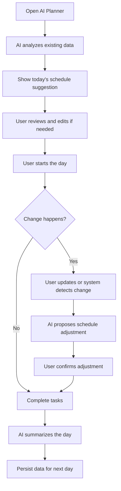

# User Flow

## Core Flow

## Supporting flows

### Task creation

Open screen -> tap add task -> enter required fields -> save -> task appears in schedule or task list.

### Schedule edit

Open today view -> tap schedule item -> edit time or priority -> save -> AI recalculates if needed.

### AI regeneration

Open today's plan -> tap regenerate -> AI rebuilds suggestion using current data -> user reviews diff -> accept or reject.

## Flow rules

- Không có dead end
- Mọi màn hình phải có đường quay lại flow chính
- Sau mỗi thay đổi, người dùng phải biết trạng thái tiếp theo là gì
- AI chỉ tham gia khi có dữ liệu đủ hoặc khi user yêu cầu

## Breakpoints that must not happen

- Home -> Task -> Save -> ?
- AI generating -> no loading state
- AI failed -> user không biết phải làm gì tiếp theo
- User rejects plan -> không có phương án thay thế
