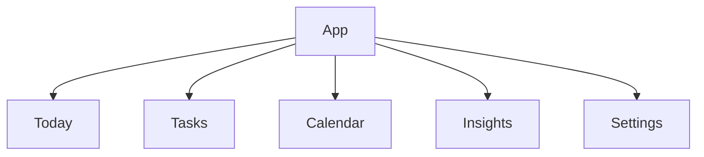

# Information Architecture

## Top-level structure

## Screen map

### Today

- daily overview
- AI suggestion
- quick actions
- current task list

### Tasks

- all tasks
- create task
- edit task
- task detail

### Calendar

- day view
- week view
- month view
- timeline

### Insights

- completion summary
- behavior trends
- AI feedback history

### Settings

- profile
- preferences
- data controls
- AI behavior settings

## Navigation principles

- Today là màn hình mặc định sau login
- Calendar không thay thế Today
- Tasks là nơi quản lý dữ liệu, không phải nơi ra quyết định chính
- Insights là màn hình xem kết quả, không phải màn hình tác vụ chính

## Content hierarchy

1. Hôm nay cần làm gì
2. AI đề xuất gì
3. Người dùng cần chỉnh gì
4. Tiến độ ra sao
5. Thiết lập hệ thống
